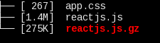
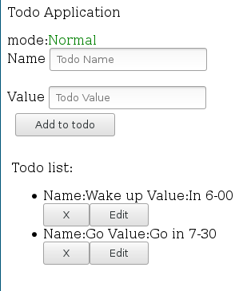
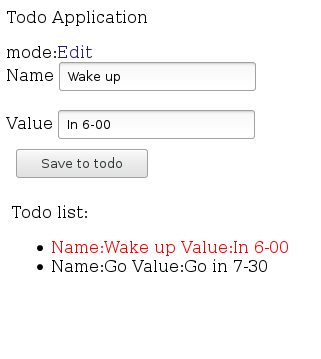

# gotodo

 Example simple reactjs like todo application.
 
 To create are used:
 
 gopherjs - https://github.com/gopherjs/gopherjs
 
 reactjs binding -  https://github.com/myitcv/react
 
 notify - https://github.com/gu-io/gu/tree/master/notifications
 
 Run:
 go generate && gopherjs build -m -o assets/gotodo.js 
 
 
Size of generated files(gzip also are shown):

Normal mode view:

Edited mode view:

